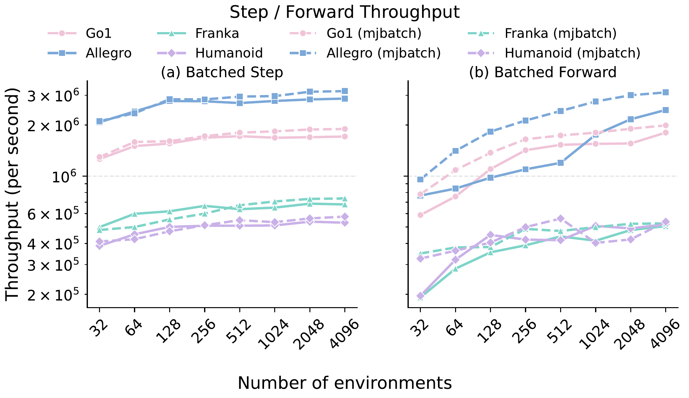
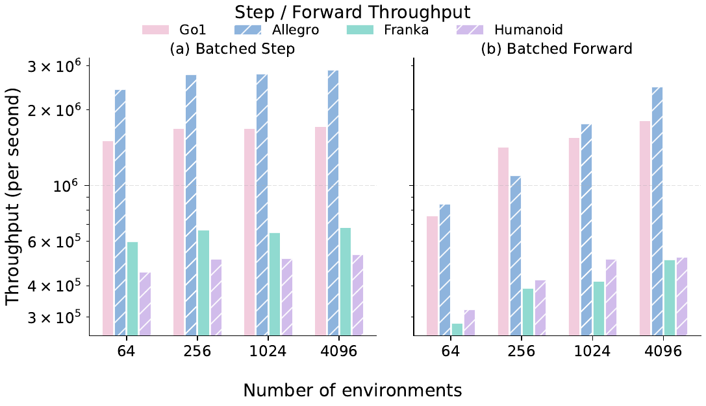
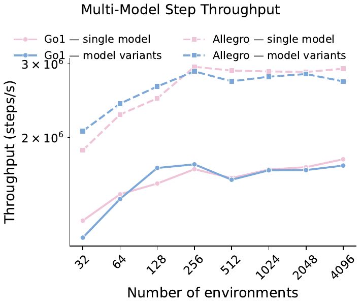
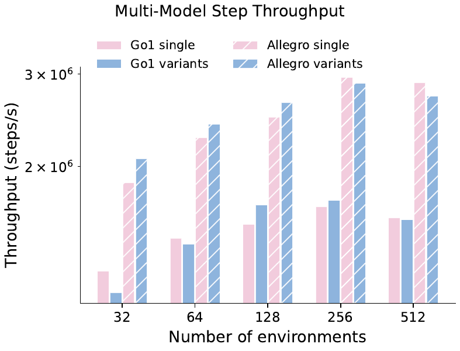
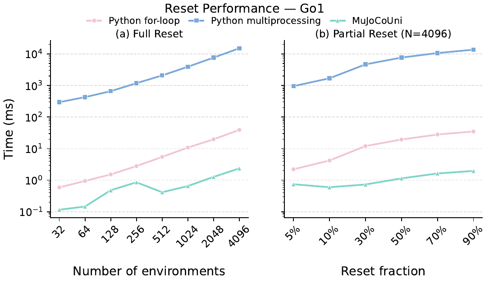
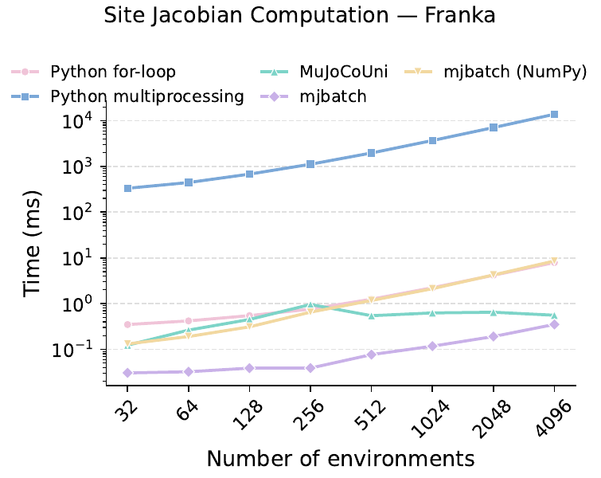
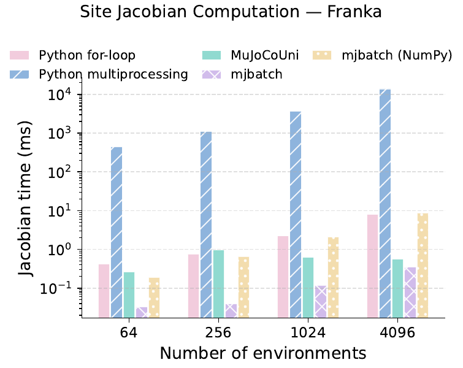
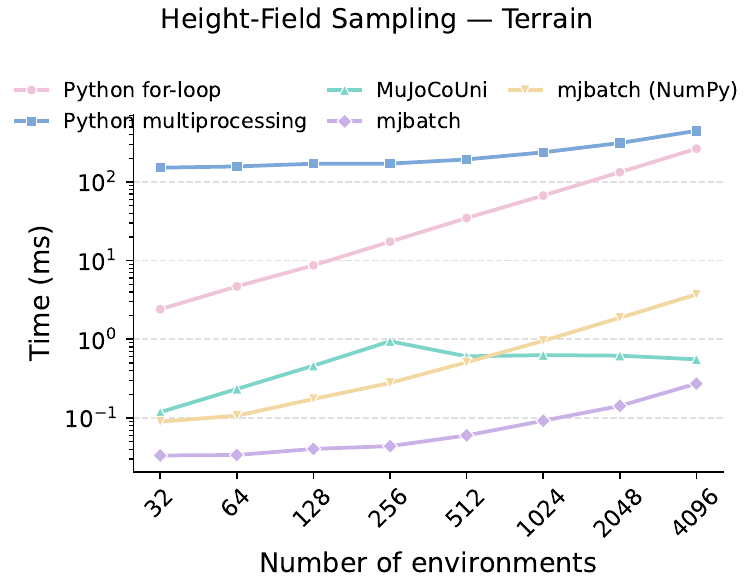
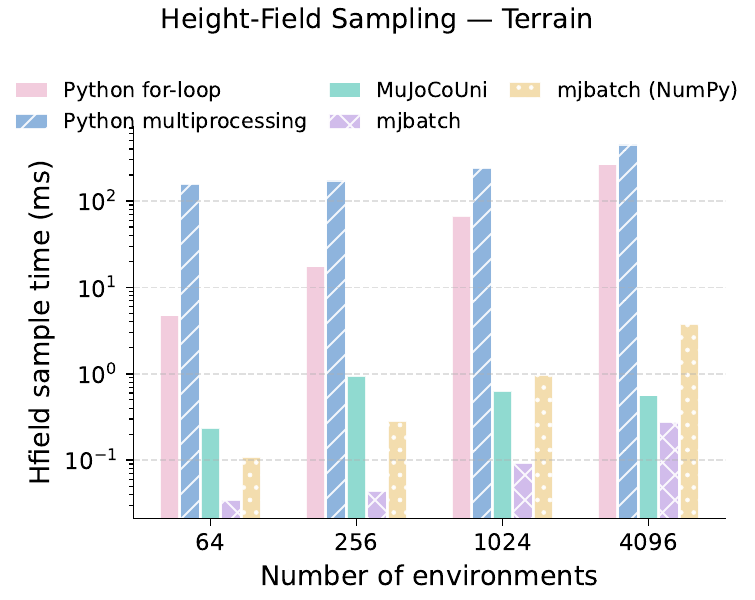

# MuJoCoUni 基准测试报告

**日期**：2026-09-11
**代码仓库**：`mujoco_uni_bench`
**运行时**：`mujoco_uni_runtime` 0.5.0（`mujoco_uni.batch_env.BatchEnvPool`）、`mjbatch` 0.1.0+git.6a176de（`feat/jac-site-sample-hfield`，新增 `jac_site` / `sample_hfield` 批量查询接口，见 [unilabsim/mjbatch#1](https://github.com/unilabsim/mjbatch/pull/1)）

[English version](benchmark_report_en.md)

## 概述

本报告评估 **MuJoCoUni** 的批量物理仿真能力。核心被测对象是 `BatchEnvPool`——一个 C++ 线程池实现的高性能批量环境接口。对照实现包括两种常见 Python 基线，以及同样基于官方 MuJoCo 的 C++ 批量执行器 **mjbatch**：

- **Python for-loop**：在单进程中逐环境串行调用 `mj_step` / `mj_forward` 等 API；
- **Python multiprocessing**：使用 `ProcessPoolExecutor` 将环境分发到多个进程并行执行；
- **mjbatch**（`Batch`）：nanobind 绑定的 C++ 线程池批量执行器，支持 per-sim 模型字段展开；reset 为 `mj_resetData` + 待定字段写入 + `mj_forward`；查询类操作提供原生批量接口 `jac_site` / `sample_hfield`；
- **mjbatch (NumPy)**：原版（无查询接口的）mjbatch 能达到的最优实现——`forward()` 之后从绑定派生字段（`cdof` / `subtree_com` / `site_xpos`、`geom_xpos` / `geom_xmat` / `xpos`）在宿主机用 NumPy 向量化组装结果。

测试覆盖五类典型强化学习/机器人工作负载：批量步进与前向动力学、多模型（每个环境独立模型实例）步进、环境重置（全量与部分）、站点雅可比计算、高度场采样。其中 mjbatch 参与第 1、3、4、5 项（吞吐、环境重置、雅可比、高度场），第 4、5 项同时给出原生接口与原版 NumPy 实现的效率对比。

## 测试环境

| 项目 | 配置 |
|------|------|
| CPU | AMD Ryzen 9 9950X3D（16 核 / 32 线程） |
| 线程数 | 16（`--nthread` 默认值） |
| OS | Linux 7.0.0-30-generic (x86_64, glibc 2.39) |
| Python | 3.12.3 |
| NumPy | 2.5.3 |
| MuJoCo | 3.11.0 |
| MuJoCoUni 运行时 | mujoco_uni_runtime 0.5.0 |
| mjbatch | 0.1.0+git.6a176de（feat/jac-site-sample-hfield） |

## 测试方法

- **环境数量**：32, 64, 128, 256, 512, 1024, 2048, 4096（每个环境初始状态为带微小随机扰动的合法状态）；
- **每轮步数**：`nstep = 50`；
- **计时方式**：C++ 快速路径 warmup=5 / repeat=50 取均值；Python 基线因慢 2–3 个数量级，warmup=2 / repeat=3；
- **Forward 调度**：线程池 `chunk_size = 4`（mjbatch 无对应参数）；
- **测试模型**：Unitree Go1（18 DoF 四足）、Wonik Allegro Hand（16 DoF 灵巧手）、Franka Panda（9 DoF 机械臂）、CMU Humanoid（56 DoF 人形）、楼梯地形高度场。
- **mjbatch 状态注入**：mjbatch 的 `bind("state")` 是不透明的 `mjSTATE_INTEGRATION` 行（含 warmstart），与共享的 `mjSTATE_FULLPHYSICS` 状态数组不兼容，故通过 `bind("time"/"qpos"/"qvel"/"act")` 逐字段注入。又因 mjbatch 对绑定输入字段做"相对上次写入的变化检测"，重复写入相同状态会被跳过（而 reset 会把 sim 状态冲回默认值），所以注入器在两份相差 1e-12 的状态副本间交替写入，保证每次调用都发生完整拷贝——与其他实现每次调用都复制状态的口径对齐。第 4、5 项的两个 mjbatch 手臂计时均包含状态注入。
- **mjbatch 查询接口口径**：原生 `jac_site` 内部只跑 `mj_kinematics` + `mj_comPos`，`sample_hfield` 只跑 `mj_kinematics`，均不执行完整 `mj_forward`；原版 NumPy 手臂则必须 `forward()` 再取派生字段组装（mjbatch 无 kinematics-only 调用），这正是两者的对比意义。派生字段的 `bind` 在计时开始前一次性完成（mjbatch 绑定语义：字段在绑定后的下一次调用才拷出）。
- **已知口径差异**：mjbatch 的 reset 尾部执行完整 `mj_forward`，MuJoCoUni 的 reset 使用 `mj_forwardSkip`。

---

## 1. 批量 Step / Forward 吞吐

四种机器人模型在 32–4096 个环境下的步进（steps/s）与前向动力学（forwards/s）吞吐（实线 MuJoCoUni，虚线 mjbatch）：



| 模型 | 实现 | Step（32 envs） | Step（4096 envs） | Forward（32 envs） | Forward（4096 envs） |
|------|------|----------------:|------------------:|-------------------:|---------------------:|
| Go1 | MuJoCoUni | 1.26M steps/s | 1.71M steps/s | 0.59M fwd/s | 1.81M fwd/s |
| Go1 | mjbatch | 1.30M steps/s | 1.90M steps/s | 0.78M fwd/s | 1.99M fwd/s |
| Allegro | MuJoCoUni | 2.08M steps/s | 2.87M steps/s | 0.77M fwd/s | 2.46M fwd/s |
| Allegro | mjbatch | 2.11M steps/s | 3.17M steps/s | 0.95M fwd/s | 3.12M fwd/s |
| Franka | MuJoCoUni | 0.50M steps/s | 0.68M steps/s | 0.19M fwd/s | 0.51M fwd/s |
| Franka | mjbatch | 0.48M steps/s | 0.74M steps/s | 0.35M fwd/s | 0.52M fwd/s |
| Humanoid | MuJoCoUni | 0.39M steps/s | 0.53M steps/s | 0.20M fwd/s | 0.52M fwd/s |
| Humanoid | mjbatch | 0.41M steps/s | 0.58M steps/s | 0.33M fwd/s | 0.54M fwd/s |

mjbatch 相对 MuJoCoUni 的比值（4096 envs）：Go1 step 1.11× / fwd 1.10×；Allegro step 1.10× / fwd 1.27×；Franka step 1.08× / fwd 1.04×；Humanoid step 1.09× / fwd 1.03×。

吞吐随环境数增长并在约 256–1024 envs 后趋于饱和，此时 16 个线程已全部打满。结构更简单的模型（Allegro、Go1）达到约 2–3M steps/s；自由度更高的 Humanoid 仍超过 0.5M steps/s。两个 C++ 实现整体处于同一量级：mjbatch 在所有模型上一致小幅领先（step +8–11%，forward +3–27%），并在小规模（32 envs）forward 上领先最明显（Go1 0.78M vs 0.59M，Franka 0.35M vs 0.19M），说明其每次调用的固定调度开销更低。

注意：MuJoCoUni 与 mjbatch 两组数据采集于不同会话（同机同配置），非严格交替 A/B，几个百分点的差异可能包含机器状态漂移；结论性对比应以 `mujoco-uni-bench --bench 1 --impl batch_env mjbatch` 同进程交替复测为准。



## 2. 多模型步进（单模型 vs 模型变体）

`BatchEnvPool` 支持两种构造方式：所有环境共享一个 `MjModel`（single），或为每个环境传入独立的模型实例（model variants，适用于域随机化等场景）。下面对比两者的步进开销：



| 模型 | single（4096 envs） | variants（4096 envs） | variants / single |
|------|--------------------:|----------------------:|------------------:|
| Go1 | 1.77M steps/s | 1.71M steps/s | 96.6% |
| Allegro | 2.92M steps/s | 2.72M steps/s | 93.2% |

每环境独立模型实例的吞吐损失仅约 3–7%，说明多模型路径没有引入显著的调度或缓存开销。



## 3. 环境重置（全量 + 部分）

Go1 模型的重置延迟（毫秒，越低越好）。左图为全量重置随环境数的变化，右图为 4096 个环境中按不同比例部分重置：



**全量重置**：

| 方法 | 32 envs | 4096 envs | 相对 MuJoCoUni（4096 envs） |
|------|--------:|----------:|---------------------------:|
| Python for-loop | 0.59 ms | 39.2 ms | 16.6× 慢 |
| Python multiprocessing | 296 ms | 15,100 ms | 6,400× 慢 |
| **MuJoCoUni** | 0.116 ms | **2.36 ms** | — |
| mjbatch | **0.044 ms** | 2.48 ms | 1.05× 慢 |

**部分重置（N=4096）**：

| 方法 | 5% envs | 30% envs | 50% envs | 90% envs |
|------|--------:|---------:|---------:|---------:|
| Python for-loop | 2.21 ms | — | — | 34.9 ms |
| Python multiprocessing | 955 ms | — | — | 13,600 ms |
| **MuJoCoUni** | 0.75 ms | 0.73 ms | 1.14 ms | **1.97 ms** |
| mjbatch | **0.16 ms** | 0.78 ms | 1.24 ms | 2.16 ms |

multiprocessing 基线受进程启动与序列化开销支配，即使重置少量环境也需近 1 秒。两个 C++ 实现的重置延迟都与重置比例近似线性，且呈现出互补的区间特性：**小规模/低比例重置 mjbatch 更快**（32 envs 全量 0.044 ms vs 0.116 ms，5% 部分重置 0.16 ms vs 0.75 ms），每次调用的固定开销更低；**大规模重置 MuJoCoUni 略快**（4096 全量 2.36 ms vs 2.48 ms，90% 部分 1.97 ms vs 2.16 ms，约 5–10%），与其融合的稀疏 reset 内核 + `mj_forwardSkip` 一致（mjbatch 尾部执行完整 `mj_forward`）。对 RL 训练中最常见的形态——每次只重置少数终止环境（5–10%）——mjbatch 的延迟反而更低。

## 4. 站点雅可比计算（Franka）

对 Franka 机械臂的 `end_effector` 站点批量计算位置/姿态雅可比（`compute_site_jacobians`；mjbatch 手臂含状态注入）：



| 方法 | 32 envs | 4096 envs | 相对 MuJoCoUni（4096 envs） |
|------|--------:|----------:|---------------------------:|
| Python for-loop | 0.35 ms | 7.9 ms | 14× 慢 |
| Python multiprocessing | 333 ms | 13,800 ms | 24,800× 慢 |
| **MuJoCoUni** | 0.12 ms | **0.56 ms** | — |
| **mjbatch（原生 `jac_site`）** | **0.031 ms** | 0.35 ms | **1.6× 快** |
| mjbatch（原版 NumPy 组装） | 0.13 ms | 8.6 ms | 15× 慢 |

两个 C++ 批量接口（MuJoCoUni 与 mjbatch 原生 op）都远快于 Python 基线；mjbatch 原生 `jac_site` 只跑 kinematics + comPos，固定开销更低，全规模段都略快于 MuJoCoUni。原版 mjbatch（NumPy 组装）即使完全向量化，也被完整 `mj_forward`、宽派生字段拷出与宿主机组装拖累，4096 envs 时已慢于 Python for-loop 基线——说明这类查询操作必须有原生批量内核才有意义。数值正确性上，两个 mjbatch 手臂与串行 `mj_jacSite` 参考位级一致（max err 0.0）。



## 5. 高度场采样（楼梯地形）

在楼梯地形模型上，围绕机器人基座采样 4×4 网格共 16 个点的高度（双线性插值，`sample_hfield_height`；mjbatch 手臂含状态注入）：



| 方法 | 32 envs | 4096 envs | 相对 MuJoCoUni（4096 envs） |
|------|--------:|----------:|---------------------------:|
| Python for-loop | 2.41 ms | 264 ms | 475× 慢 |
| Python multiprocessing | 152 ms | 446 ms | 802× 慢 |
| **MuJoCoUni** | 0.12 ms | **0.56 ms** | — |
| **mjbatch（原生 `sample_hfield`）** | **0.033 ms** | **0.27 ms** | **2.0× 快** |
| mjbatch（原版 NumPy 组装） | 0.090 ms | 3.7 ms | 6.7× 慢 |

纯 Python 实现的双线性插值即使只处理 32 个环境也需 2.4 ms，而 MuJoCoUni 处理 4096 个环境仅需 0.56 ms；mjbatch 原生 `sample_hfield` 只跑 kinematics 加 C++ 内插值，0.27 ms 完成同样规模。原版 NumPy 手臂虽比 for-loop 快约 70×（向量化插值摊销了 Python 开销），但完整 `mj_forward` 的下限决定了它比原生 op 慢一个数量级。数值正确性上，两个 mjbatch 手臂与串行双线性参考一致（native max err 0.0，NumPy 手臂 ~1e-15）。



---

## 结论

1. **吞吐**：批量步进在简单到中等复杂度模型上达到 2–3M steps/s（16 线程），在 256–1024 envs 后饱和；mjbatch 与 MuJoCoUni 同量级并在四种模型上一致小幅领先（step 约 +10%）；
2. **多模型**：每环境独立模型实例的额外开销仅 3–7%，可放心用于域随机化；
3. **延迟敏感操作**（重置、雅可比、高度场采样）：MuJoCoUni 相对 Python for-loop 快 1–3 个数量级，相对 Python multiprocessing 快 3–4 个数量级——multiprocessing 的进程管理与数据序列化开销在细粒度批量操作上完全无法摊销。环境重置上 mjbatch 与 MuJoCoUni 区间互补：低比例/小规模重置 mjbatch 固定开销更低，全量重置 MuJoCoUni 的融合内核略优（5–10%）；
4. **批量查询接口**：mjbatch 新增的原生 `jac_site` / `sample_hfield` 把雅可比与高度场采样做成了线程池内的一等公民操作（kinematics 级，无需完整 forward），两项都比 MuJoCoUni 对应接口还快 1.6–2.0×（4096 envs）；而"原版 mjbatch + NumPy 组装"受完整 `mj_forward` 与派生字段拷出所限，比原生 op 慢一个数量级——查询类批量操作留在 C++ 侧是数量级级别的差异；
5. 对于 RL 训练中高频调用的 reset 与观测计算路径，C++ 批量接口能消除原本占主导的 Python 开销；
6. 工程差异：mjbatch 的状态注入需注意 `mjSTATE_INTEGRATION` 不透明行布局与"变化才写入"的拷贝语义，派生字段的 `bind` 要在物理调用之前完成；MuJoCoUni 的 reset 原生接受 FULLPHYSICS 状态数组，接口更直接。

## 复现

```bash
# 安装（含 MuJoCoUni 运行时；mjbatch 手臂需再加 --extra mjbatch）
uv sync --extra mujoco-uni-runtime
uv sync --extra mujoco-uni-runtime --extra mjbatch

# 运行全部基准（约 12 分钟，结果写入 benchmark_results.json）
mujoco-uni-bench

# mjbatch 吞吐 + 重置（结果写入 benchmark_results_mjbatch.json）
mujoco-uni-bench --bench 1 3 --impl mjbatch --output benchmark_results_mjbatch.json

# mjbatch 雅可比 + 高度场（原生 op 与原版 NumPy 手臂）
mujoco-uni-bench --bench 4 5 --impl mjbatch --output benchmark_results_mjbatch_queries.json

# 两个 C++ 实现同进程交替对比
mujoco-uni-bench --bench 1 --impl batch_env mjbatch

# 生成全部图（默认输出 figures/）
mujoco-uni-plot
```

单项基准可用 `--bench N` 选择（1=Step/Forward，2=多模型，3=重置，4=雅可比，5=高度场）；图可用 `--fig N` 选择。更多参数见 `mujoco-uni-bench --help` 与 `mujoco-uni-plot --help`。

数据文件：`benchmark_results.json`（Python 基线 + MuJoCoUni，全部 5 项）、`benchmark_results_mjbatch.json`（mjbatch，第 1、3、4、5 项）、`benchmark_results_mjbatch_queries.json`（mjbatch 第 4、5 项的单独运行记录）、`benchmark_results_combined.json`（全部合并，本报告图表数据源）。

## 模型来源

| 模型 | 来源 | 许可证 |
|------|------|--------|
| Unitree Go1 | [MuJoCo Menagerie](https://github.com/google-deepmind/mujoco_menagerie) | Apache 2.0 |
| Wonik Allegro | [MuJoCo Menagerie](https://github.com/google-deepmind/mujoco_menagerie) | Apache 2.0 |
| Franka Panda | [MuJoCo Menagerie](https://github.com/google-deepmind/mujoco_menagerie) | Apache 2.0 |
| CMU Humanoid | [dm_control](https://github.com/google-deepmind/dm_control) | Apache 2.0 |
| 楼梯地形 | [MuJoCo-LiDAR](https://github.com/discoverse-dev/MuJoCo-LiDAR) | MIT |
